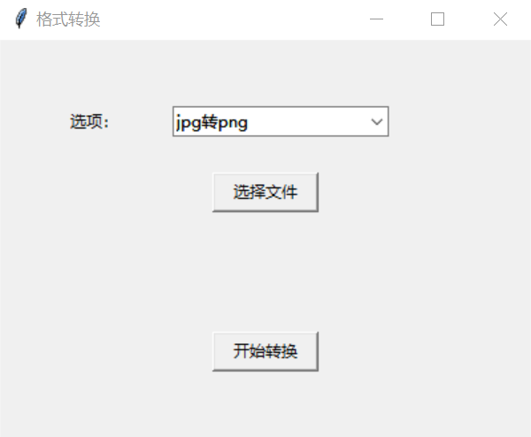
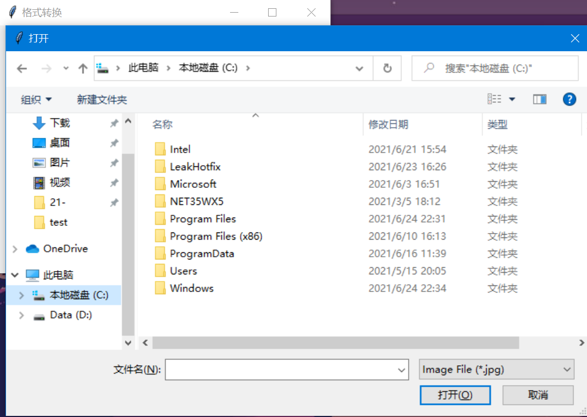

# 2021-7-Reformat
## 项目介绍
本项目旨在使用python编写一个常用的格式转换工具，目前支持jpg与png、jpg与pdf、mp3与wav几个常用格式的互转。
## 小组分工
梁炜：jpg和png互转

程宇伟：jpg和pdf互转

郎子轩：mp3和wav互转

叶俊杭：界面设计和开发

## 运行方式
### 1.直接运行程序
下载Release中打包好的exe程序，可直接在64位Windows操作系统中运行。目前打包的程序还不支持mp3与wav格式的互转。
### 2.编译运行代码
#### 环境准备
该项目代码在Windows10系统python3.8.5环境中测试成功运行

需事先安装pillow、tkinter、PyMuPDF、pydub库，安装[ffmpeg](http://ffmpeg.org/)并配置好环境变量

## 演示视频

演示视频请查看Release中的video.7z文件

## 测试截图

